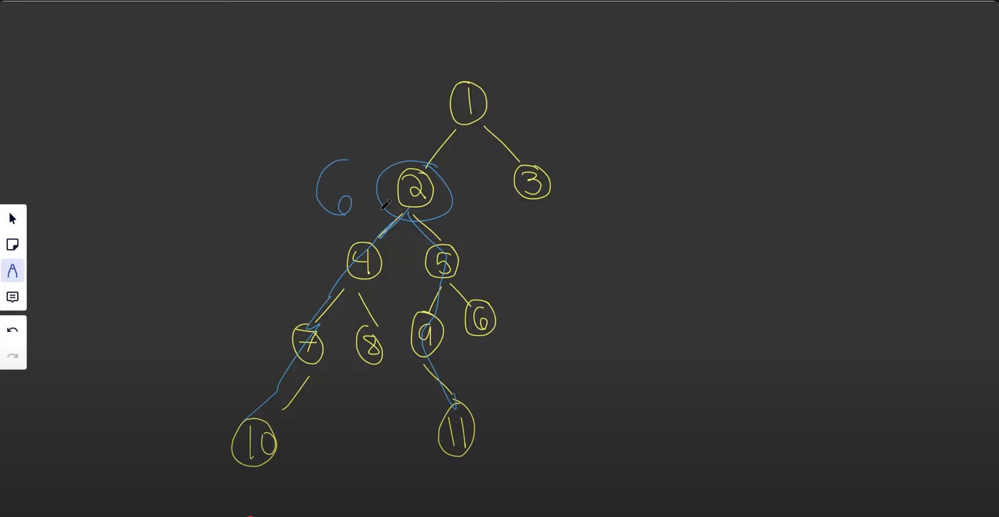

# Diameter of A Binary Tree

> - Difficulty: Easy
> - Type: Trees
> - [link](https://leetcode.com/problems/diameter-of-binary-tree/)

## Solution
- Time complexity: O(N), where N is the number of nodes in the tree. Each node is visited once.
- Space complexity: O(H), where H is the height of the tree (recursive stack).

- Note: The longest diameter does not have to go through the root.



```python
class Solution:
    def diameterOfBinaryTree(self, root: TreeNode) -> int:
        self.diameter = 0  # Keeps track of the maximum diameter

        # DFS
        def height(node):
            if not node:
                return 0  # Base case: height of null node is 0
            
            left_height = height(node.left)   # Get height of left subtree
            right_height = height(node.right) # Get height of right subtree
            
            # Update the diameter (longest path found so far)
            self.diameter = max(self.diameter, left_height + right_height)
            
            # Return height of current node
            return 1 + max(left_height, right_height)
        
        height(root)  # Start DFS from root
        return self.diameter  # Final diameter value
```